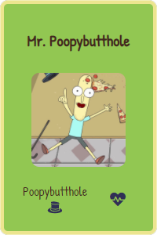
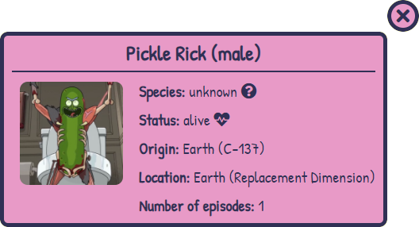

#  **Módulo 3 - Evaluación final Adalab - React**

## **Descripción:**

Página de búsqueda y filtrado de personajes de la serie de TV _Rick & Morty_. Toda la información se consigue a través del [API de _Rick & Morty_](https://rickandmortyapi.com/). Tras hacer la búsqueda, los personajes encontrados se muestran en tarjetas que podrán clickarse para obtener más información sobre el personaje.

Se ha utilizado JavaScript, React, HTML y CSS para la realización de esta SPA.

## PASOS:

### 1. **LISTADO DE PERSONAJES:**

Listado en tarjetas de los 20 primeros personajes que devuelve la API, con la foto, nombre y especie.

### 2. **FILTRADO DE PERSONAJES:**

Filtro por nombre de personaje.

### 3. **COMPONENTES DE REACT:**

La APP está dividida en diferentes componentes que permiten la reutilización de código y funcionalidades:

- Filtros.
<p align="center">

</p>

- Listado.
- Tarjeta de cada personaje.

<p align="center">

</p>

- Detalle de cada personaje.

### 4. **TARJETA DE DETALLE DE PERSONAJE:**

Funcionalidad que permite, al hacer click sobre la tarjeta del personaje de la búsqueda, acceder a una tarjeta con más información sobre el personaje (planeta de origen, localización , número de episodios en los que aparece y género).

<p align="center">

</p>

### 5. **CALIDAD:**

- Semántica de las etiquetas de HTML correcta.
- Evitar navegación al hacer intro en la búsqueda.
- Aparición de alertas cuando la búsqueda no arroja ningún resultado.
- Filtrado con independencia de mayúsculas y minúsculas.
- Implementación del almacenamiento local para guardar las búsquedas cuando la usuaria entra y sale de las tarjetas de detalle del personaje.

### 6. **BONUS:**

- Mejoras visuales: mostrar información con iconos, usar grid para las tarjetas, maquetación responsive.
- Crear URL dinámicas para las tarjetas de personaje y URL para personajes inexistentes.
- Ordenar la lista por orden alfabético y analfabético.
- Añadir filtros extra: estado, especie y género.

- Añadir un botón de reset para limpiar todos los campos de búsqueda y filtrado.
- Añadir la posibilidad de navegar por las diferentes páginas de personajes del API.

<p align="center">

</p>

- Almacenar en el _local storage_ la información de la búsqueda realizada.

## Instalar todo lo necesario para disfrutar del proyecto:

1. **Descarga** el [respositorio](https://github.com/Adalab/modulo-3-evaluacion-final-2y2son4.git) de GitHub y descomprime la carpeta.
2. **Abre una terminal** en la carpeta raíz del ejercicio.
3. **Instala las dependencias** locales ejecutando en la terminal el comando:

```bash
npm install
```

### Pasos para arrancar el proyecto:

Una vez instaladas las dependencias, arranca el proyecto ejecutando el comando:

```bash
npm start
```

Se abrirá una ventana del explorador y ya podrás usar la aplicación.

### **Enlaces:**

- Link a la [página](https://beta.adalab.es/modulo-3-evaluacion-final-2y2son4/) del ejercicio.

- Link a mi [perfil ](https://github.com/2y2son4)de GitHub.

## **Wubba Lubba Dub Dub!!**


